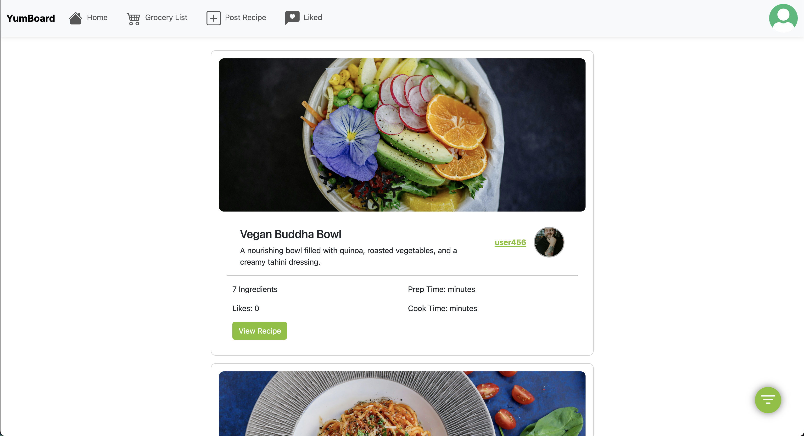

# YumBoard

## Table of contents
- [Application Description](#application-description)
- [Contributors](#contributors)
- [Technology Stack](#technology-stack)
- [Prerequisites](#prerequisites)
- [How to run](#how-to-run)
- [How to test](#how-to-run-tests)
- [Deployed Application](#deployed-application)
- [Environment Variables](#environment-variables)
- [How to edit scss files](#how-to-edit-scss-files)

## Application Description:

YumBoard is a social media app designed to allow anyone to see recipes their friends are making, and share their own culinary creations. It features a built-in grocery list which interfaces with shared recipes, and can give you an estimate of cost for your grocery list. 

## Contributors:

  - José Camacho Guadamuz 
  - Aryaman Singh
  - Jason Gao 
  - Dresden Friar
  - Jackson Vondemkamp 

## Technology Stack:

- Docker
- NodeJS & Express
- Javascript, HTML, CSS
- Handlebars
- Bootstrap
- Kroger API

## Prerequisites:

- NodeJS `v23.6.0` or greater
- NPM `11.2.0` or greater
- Docker Desktop

## How to run:

1. Clone the repository to your local machine.
2. Using a terminal, navigate to the `ProjectSourceCode` directory.
3. Run `npm install`.
4. Ensure there is a `.env` file inside [ProjectSourceCode](./ProjectSourceCode/.env), and that it contains the correct information.
	- More info on the `.env` file in the  [Environment Varibles](#environment-varibles) section.
5. Ensure that the desired startup command is in [docker-compose.yaml](./ProjectSourceCode/docker-compose.yaml).
	- Use `npm run testandrun` to run tests *and* start the server.
	- Use `npm start` to just run the plain server.
6. Then, run `docker-compose up` to start it. This may take some time to finish.
7. The server is now running, and the application can be found at [localhost:3000](localhost:3000).

>[!CAUTION]
>
>Sometimes when running tests or working on developing code, there will be weird database errors. 
>
>Sometimes you can fix them by running `docker-compose down -v` (even if you stop it with `ctrl-c`), which will erase the database and give everything a fresh start. 
>

## How to run tests

After successfully completing the steps from [How to run](#how-to-run),
1. Open the file [docker-compose.yaml](./ProjectSourceCode/docker-compose.yaml).
2. Towards the bottom, change `command` from `'npm start'` to `npm run testandrun`.
3. Now, start the application like normal using the terminal command `docker-compose up`.
4. Watch the docker output in the terminal to see if the tests are successful
5. After running tests, the server will start and can be found at [localhost:3000](localhost:3000)


## Deployed Application

You can find the deployed application at [https://yumboard.onrender.com/](https://yumboard.onrender.com/).




## Environment Variables

In order to run, there needs to be a `.env` file in [ProjectSourceCode](./ProjectSourceCode/.env). The file should follow this format:

```env
POSTGRES_USER="[user here]"
POSTGRES_PASSWORD="[password here]"
POSTGRES_DB="[db name]"
POSTGRES_HOST="[host name]"
POSTGRES_PORT=5432
SESSION_SECRET="[anything here]"
  

# Kroger API
KROGER_CLIENT_ID=[Id Here]
KROGER_CLIENT_SECRET=[Secret Here]
KROGER_LOCATION_ID=[Loc Id Here]
```

>[!warning]
>You need to set a value for everything in the file. You may need to sign up and get a Kroger API key yourself in order to fill in the last 3.
>


## How to edit `scss` files:

>[!warning]
>This is for development only, and not necessary for running the application.
>

1. After running `npm install`, you can use `sass` commands.
2. Use `npm run sass:watch` to start the compiler. Now, any changes to the `.scss` files will be compiled into matching `.css` files. 
3. To generate a minified version (for website deployment), instead use `npm run sass:release`. 

>[!tip] 
>Unless you explicitly need to read the file, you should always use `npm run sass:release`.
>
>The minified version will take up slightly less space, and should be used for final deployment. It makes readability difficult, but is well worth it for any amount of space saving. 

